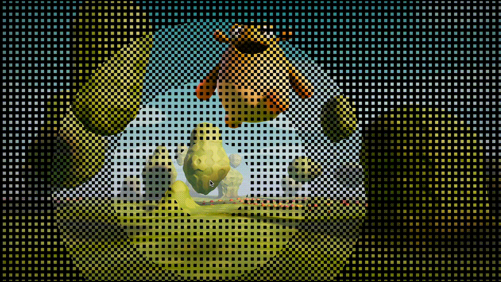
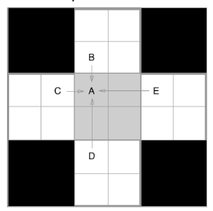
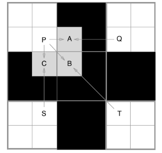

# OpenGL Foveated Rendering Demo & Playground
## CMU 15-469 S22 Final Project
### Gustavo Silvera

# What is this?

- This is a playground repository for demoing an implementation of **foveated rendering** on standard OpenGL fragment shaders. The algorithm for foveated rendering closely follows the one described in Oculus' [Tech Note: Mask-based Foveated Rendering with Unreal Engine 4](https://developer.oculus.com/blog/tech-note-mask-based-foveated-rendering-with-unreal-engine-4-/).
- This repo contains custom implementations for the pixel-dropping and reconstruction shaders in OpenGL 3.3 and I aim to eveluate the performance benefits compared to full-quality rendering across various shaders and with various tuning parameters. 

# How does it work?
- The idea behind [foveated rendering](https://en.wikipedia.org/wiki/Foveated_rendering) is quite simple: **prioritize quality in the foveal region where a user is looking, gradually decrease quality as the scene gets further into the periphery**. 
    - The ideal situation for foveated rendering is in VR applications where an eye-tracker can be built-in to a VR headset (see [HTC Vive Pro Eye](https://www.vive.com/us/product/vive-pro-eye/overview/)) and there is only one user looking at the content. 
    - Since this is an exercise in shader development and not necessarily VR, I simplified the process in these ways:
        1. Use mouse-based foveated rendering: ie. instead of using gaze, use the mouse cursor position as the central foveated region.
        2. Connect a camera-based eye tracking model to the program to use as an approximation of eye tracking that should be close. Currently thinking of using Antoine Lame's [GazeTracking repo](https://github.com/antoinelame/GazeTracking).

# Implementation details?
- First, the regions defining the various quality regions is determined (as a function of distance from the central region). I'm using 4 levels:
    1. **100%** quality (threshold defined in [params/params.ini:thresh1](params/params.ini)) 
    2. **75%** quality (threshold defined in [params/params.ini:thresh2](params/params.ini))
    3. **50%** quality (threshold defined in [params/params.ini:thresh3](params/params.ini))
    4. **25%** quality (Used if not in any of the other regions
## Pixel dropping
- Pixels (or groups of pixels) are dropped depending on their region as follows:
    - 
        - Image source: [Oculus devpost](https://developer.oculus.com/blog/tech-note-mask-based-foveated-rendering-with-unreal-engine-4-/)
    - Note that dropping individual pixels is usually not worthwhile as the GPU scheduling often performs work in batches anyways, but the size of these batches is tunable in [params/params.ini](params/params.ini)


- Shader source: [Happy Jumping - iq](https://www.shadertoy.com/view/3lsSzf)

## Pixel infilling/reconstruction
- After dropping pixels in the above step, we know the pattern and need to reconstruct the gaps in the image. Luckily, this can be done as a (relatively inexpensive) **post-processing** step that uses the previous shader's framebuffer as a texture to perform its pixel fetching. 
    - The standard approach is to use trilinear interpolation when enough data is available (in the 75% and 50% quality regions), and revert to bilinear when there is not enough neighbourhing information (in the 25% quality range).

| 75%, 50% quality (trilinear) | 25% quality (bilinear) |
| --- | --- |
|  |  |
- Image source: [Oculus devpost](https://developer.oculus.com/blog/tech-note-mask-based-foveated-rendering-with-unreal-engine-4-/)


(if you look closely [especially when the animation is paused] you can see a ring around the mouse cursor where the various regions are defined)


- Shader source: [Happy Jumping - iq](https://www.shadertoy.com/view/3lsSzf)


# What works?

- Currently, the foveated-rendering pixel dropping shader works in that it can call other fragment shaders (see [`shaders.md`](src/shaders/shaders.md)) while dropping pixels according to their region.
- Also, the foveated-rendering reconstruction (infilling) shader works for the first two levels. It is currently using trilinear interpolation for the first two foveal regions (75% and 50% quality) and this works reasonably well!
- You can pause the shader while its running by pressing `SPACE`.
- You can reload the shaders and switch to the next shader in `shaders/main/*.glsl` by pressing `R`.
- You can exit the application by pressing `ESC`.
- All params work as expected in [`params/params.ini`](params/params.ini)
    - Currently can tune things like the pixel group size, thresholds for the foveal region radii, whether or not to use the foveated rendering & postprocessing shaders, and paths for the shaders.


# What doesn't work?

- I haven't finished the bilinear interpolation step of the reconstruction shader for the last (25% quality) foveal region.
- I haven't plugged in an eye-tracking functionality yet. Once I have one reliable and fast enough, I plan on using the eye gaze coordinates as indicators for the central foveal region instead of the mouse cursor.


# How to build
This has been tested on my M1 Max 14" laptop running MacOS 12.3. Ideally it should be fairly cross-platform but I haven't tested on Linux/Windows. 

## Prerequisites
Ensure you have the following dependencies:
- `clang` with `c++17` support
- `make`, `cmake`, and `c++`

## Install OpenGL (specifically glfw)
First you'll need to install `glfw`. This can be simply done as follows:
```bash
git clone https://github.com/glfw/glfw
cd glfw
mkdir build && cd build
cmake -DCMAKE_OSX_ARCHITECTURES=arm64 ..
make -j10
sudo make install # installs to system path (requires sudo)
```
- This will install `glfw` to `/usr/local/lib` on a MacOS machine. 
- The `-DCMAKE_OSX_ARCHITECTURES=arm64` is for my machine which uses an arm64 processor.


## Build `gl-fovrender`
```bash
git clone https://github.com/gustavosilvera/gl-fovrender
cd gl-fovrender
mkdir build && cd build
cmake ..
make -j10
```

## Run `gl-fovrender`
```bash
# use default params file location
./gl-fovrender 

# or choose a designated params file
./gl-fovrender /path/to/params.ini
```

# Next Steps?
- I was wanting to implement this technology in a VR system, similar to MariosBikos_HTC's situation described in this [blog post](https://mariosbikos.com/vive-unreal-foveated-rendering/). Unfortunately UE4.26 is not officially supported and I've had limited success in hacking the engine to support the NVidia Variable Rate Shading effectively in release/package mode.

## Acknowledgements
- Idea & implementation details were sourced from this [Oculus developer post](https://developer.oculus.com/blog/tech-note-mask-based-foveated-rendering-with-unreal-engine-4-/).
- Heavy inspiration and initial help was taken from this blog post on [opengl and cpp on m1 mac](https://carette.xyz/posts/opengl_and_cpp_on_m1_mac/) by Antonin Carette (original repository [here](https://github.com/k0pernicus/opengl-explorer))
- Various shadertoy shaders were used in development of this project (see [src/shaders/shaders.md](src/shaders/shaders.md)).
- Eye tracking functionality is built on Antoine Lame's [GazeTracking repo](https://github.com/antoinelame/GazeTracking)